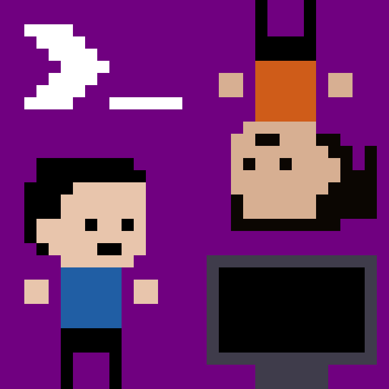

<!-- Logo -->

<h2 align="middle">The Official WIRED Podcast!</h2>  
Want to know the best Uni hacks? :computer: Uncover hidden conspiracies? :alien: And stay connected to the latest news around the Monash Campus?  
Plug in your headphones and stay WIRED_in!

<i>Hosted by Edison Vong and Ruoqi Wang 
Affiliated with <a href="https://www.radiomonash.net/" target="_blank">Radio Monash</a></i>

    
      
     
    
<b>Subscribe to our podcast!</b>

<h3>Share your thoughts with us!</h3>
The WIRED Podcast team is looking for students to send in their thoughts and opinions of the past year, whether it's about the lockdown uni experience, advice to first years, mistakes to avoid, best units to take, or anything else you want to share :smile:
Record a 5-15 second audio snippet and send it over to us via
email (<podcast@wired.org.au>), include your name and faculty if you want a shoutout in the bio or you can stay anonymous.

### Episodes

<!-- 

  
  
    {{ item.iframe }}
  

 -->



  <h3 style="color:white">{{ episode.number }}. {{ episode.title }}</h3>
  
{{ episode.description }}

  <audio controls style="width: 100%;">
    
    
    
    <source align="center" src='{{ path }}' type="audio/mpeg">
    Your browser does not support the audio element.
  </audio>
  



 

---

 

